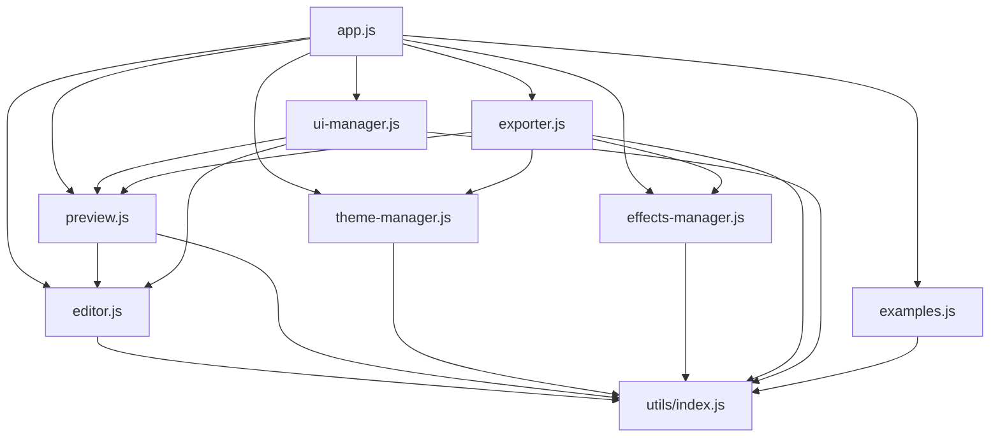

# MD2HTML - App.js 模块拆分计划

## 当前问题

`app.js` 目前存在以下问题：
1. 文件过大，包含了所有功能实现
2. 职责不够单一，混合了多个功能模块
3. 代码复用性差，很多功能耦合在一起
4. 维护困难，修改一处可能影响多处

## 功能模块分析

### 1. 核心编辑器模块 (core/editor.js)
- 编辑器初始化
- 基础样式设置
- 输入事件处理
- 行号显示功能
- 自动换行控制
- 专注模式

### 2. 预览渲染模块 (core/preview.js)
- Markdown 解析配置
- 实时预览更新
- 自定义语法处理
- 数学公式渲染
- 代码高亮处理
- 目录生成功能

### 3. 主题系统模块 (ui/theme-manager.js)
- 预览主题加载
- 编辑器主题加载
- 暗色/亮色模式切换
- 主题 CSS 处理
- 响应式主题支持

### 4. 特效系统模块 (ui/effects-manager.js)
- 特效初始化
- Particles 效果
- Deep Space 效果
- Matrix 效果
- Wave 效果
- 特效 CSS 生成

### 5. 导出功能模块 (features/exporter.js)
- HTML 导出
- Markdown 导出
- 依赖收集
- 样式内联
- 特效打包

### 6. UI 交互模块 (ui/ui-manager.js)
- 布局控制
- 分隔条拖拽
- 全屏切换
- 同步滚动
- 按钮事件处理

### 7. 示例系统模块 (features/examples.js)
- 示例加载
- 示例映射表
- 加载状态处理
- 错误处理

### 8. 工具函数模块 (utils/index.js)
- 通用辅助函数
- DOM 操作工具
- 事件处理工具
- 文件操作工具

## 依赖关系



## 拆分步骤

1. 创建模块目录结构
```
public/js/
├── app.js              # 主入口文件
├── core/              # 核心功能
│   ├── editor.js
│   └── preview.js
├── ui/                # UI 相关
│   ├── theme-manager.js
│   ├── effects-manager.js
│   └── ui-manager.js
├── features/          # 功能模块
│   ├── exporter.js
│   └── examples.js
└── utils/            # 工具函数
    └── index.js
```

2. 代码迁移顺序
   1. 首先提取工具函数模块
   2. 迁移核心编辑器模块
   3. 迁移预览渲染模块
   4. 分离主题和特效系统
   5. 抽取导出功能
   6. 重构 UI 交互
   7. 独立示例系统

3. 重构注意事项
   - 保持功能稳定性
   - 添加适当的注释
   - 确保模块间接口清晰
   - 保持向后兼容
   - 添加错误处理
   - 完善日志系统

## 预期收益

1. 代码可维护性提升
   - 各模块职责单一
   - 依赖关系清晰
   - 代码组织结构化

2. 开发效率提升
   - 便于多人协作
   - 功能扩展容易
   - 测试更加方便

3. 性能优化空间
   - 可按需加载模块
   - 便于引入缓存机制
   - 有利于代码分割

4. 更好的扩展性
   - 插件系统基础
   - 主题系统扩展
   - 特效系统增强

## 后续工作

1. 单元测试
   - 为每个模块编写测试
   - 添加集成测试
   - 设置测试覆盖率目标

2. 文档完善
   - 更新 API 文档
   - 添加模块说明
   - 完善注释

3. 性能优化
   - 引入模块懒加载
   - 优化资源加载
   - 添加性能监控

4. 功能增强
   - 完善插件系统
   - 增强主题功能
   - 优化特效系统
